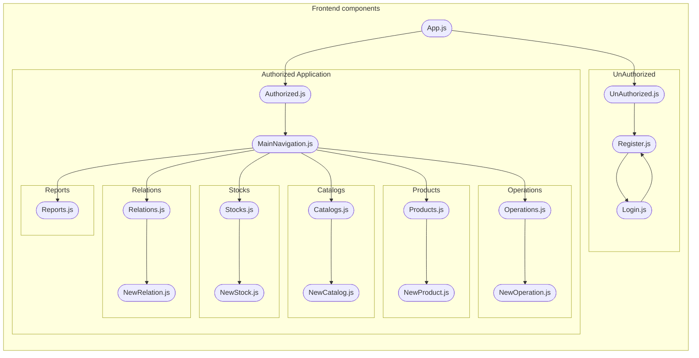

```mermaid
flowchart LR
    subgraph Frontend components
    App.js([App.js]) --> UnAuthorized.js([UnAuthorized.js])
    App.js([App.js]) --> Authorized.js([Authorized.js])

        subgraph UnAuthorized
        UnAuthorized.js([UnAuthorized.js]) --> Login.js([Login.js])
        Login.js([Login.js])
        Register.js([Register.js])
        Login.js([Login.js]) --> Register.js([Register.js])
        Register.js([Login.js]) --> Login.js([Register.js])
        end
        subgraph Authorized Application
        Authorized.js([Authorized.js]) --> MainNavigation.js([MainNavigation.js])
        MainNavigation.js([MainNavigation.js]) --> Relations.js([Relations.js])
        MainNavigation.js([MainNavigation.js]) --> Stocks.js([Stocks.js])
        MainNavigation.js([MainNavigation.js]) --> Catalogs.js([Catalogs.js])
        MainNavigation.js([MainNavigation.js]) --> Products.js([Products.js])
        MainNavigation.js([MainNavigation.js]) --> Operations.js([Operations.js])
        MainNavigation.js([MainNavigation.js]) --> Reports.js([Reports.js])

            subgraph Relations
                Relations.js([Relations.js]) --> NewRelation.js([NewRelation.js])
            end
            subgraph Stocks
                Stocks.js([Stocks.js]) --> NewStock.js([NewStock.js])
            end
            subgraph Catalogs
                Catalogs.js([Catalogs.js]) --> NewCatalog.js([NewCatalog.js])
            end
             subgraph Products
                Products.js([Products.js]) --> NewProduct.js([NewProduct.js])
            end
            subgraph Operations
                Operations.js([Operations.js]) --> NewOperation.js([NewOperation.js])
            end
            subgraph Reports
                Reports.js([Reports.js]) 
            end
        end
       
end

```